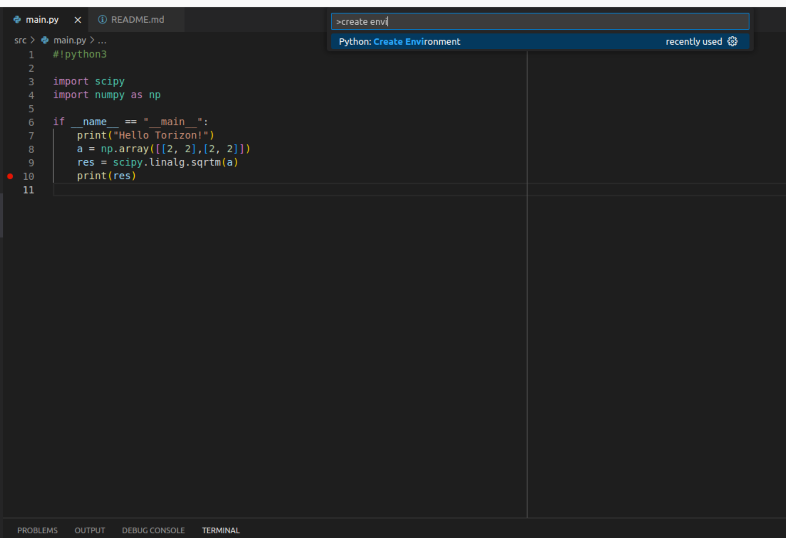

# Python 3 Console template

import ReactPlayer from 'react-player';

How to create a virtual environment on this template:

 - Press F1
 - Select the command "Python: Create Environment"
 - Select the environment type (venv or conda)
 - Select a Python interpreter (this will be the version installed inside the
 venv)
 - If it doesn't select the Python from the venv, press F1 and select the command
 "Developer: Reload Window")

To install a Python package on the venv (and also on the Debug image), put it 
on the "requirements-debug.txt" file (to install it on the Release image put it
on the "requirements.release.txt" file)

<ReactPlayer playsinline pip={true} stopOnUnmount={false} controls={true} url="./createPythonEnv.mp4" width="35vw" height="auto" preload="metadata" />

https://github.com/andreriesco/vscode-torizon-templates/blob/tie-730/assets/templatesDocumentationAssets/python3Console/createEnv.png